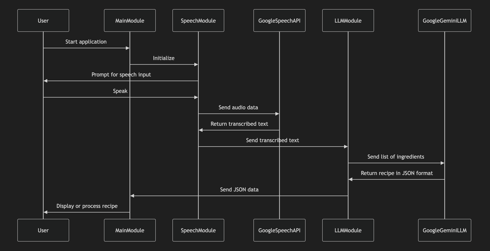

# The application overview

## LLM Module

The LLM module is responsible for:
1. Receiving the transcribed text from the speech module.
2. Sending the list of ingredients to the Google Gemini LLM.
3. Receiving the recipe in JSON format from the Google Gemini LLM.
4. Sending the JSON data back to the main module.

## Updated Workflow

1. The main module initializes the speech module.
2. The speech module listens for speech input from the user.
3. The recorded audio data is sent to the Google Speech API.
4. The Google Speech API processes the audio and returns the transcribed text.
5. The speech module receives the transcribed text and sends it to the LLM module.
6. The LLM module sends the list of ingredients to the Google Gemini LLM.
7. The Google Gemini LLM processes the ingredients and returns a recipe in JSON format.
8. The LLM module receives the JSON data and sends it back to the main module.
9. The main module handles the JSON data as needed, such as displaying the recipe or further processing.

## Dependencies

- Python 3.x
- Google Speech API
- Google Gemini LLM API
- Any additional libraries required for audio recording, processing, and handling JSON data

## Setup

1. Clone the repository.
2. Install the required dependencies.
3. Obtain API credentials for the Google Speech API and Google Gemini LLM API.
4. Run the main module to start the application.

## Usage

1. Run the main module.
2. Speak into the microphone when prompted.
3. The transcribed text will be sent to the LLM module.
4. The LLM module will send the ingredients to the Google Gemini LLM.
5. The recipe in JSON format will be displayed or processed as per the application's functionality.

## Future Enhancements

In the end, we will have a simple UI using Python to display this for the user.

## Sequence Diagram

# To run
First you need to add a file called .env and in the file add:
`GEMINI_API_KEY=xxx`
instead of xxx create a API key from here https://aistudio.google.com/app/apikeyand and insert it. 

Furtemore you will get errors for not having isntalled modules on your computer.
For instance you will need run the two following commands in the terminal of the project.
- pip install google-generativeai
- pip install python-dotenv
You actually might need to install pip as well, not sure. But google this!

Then finaly, to run the application write the following command in the terminal:
`python3 main.py`
which will execute the main method