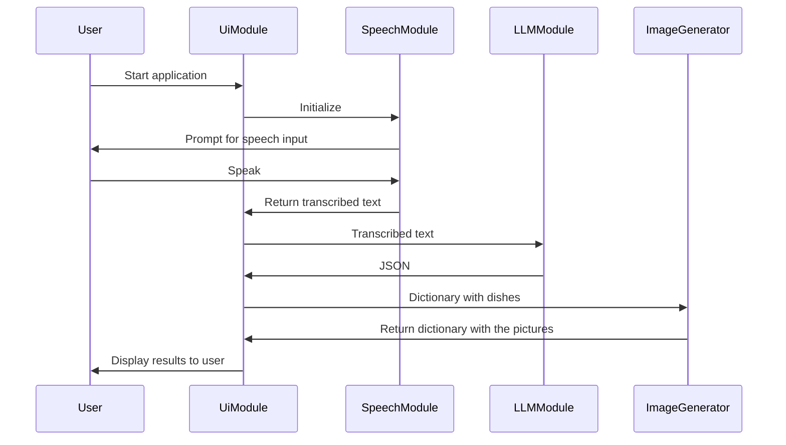

# The application overview

## Dependencies

- Python 3.x
- Google Speech Library
- Google Gemini LLM API
- Pollinations AI picture generator
- Any additional libraries required for audio recording, processing, and handling JSON data

## Setup

1. Clone the repository.
2. Install the required dependencies.
3. Obtain API credentials.
4. Run the main module to start the application.

## Usage

1. Run the main module.
2. Speak into the microphone when prompted.
3. The transcribed text will be sent to the LLM module.
4. The LLM module will send the ingredients to the Google Gemini LLM.
5. The recipe in JSON format will be displayed or processed as per the application's functionality.

# To run
First you need to add a file called .env and in the file add:
`GEMINI_API_KEY=xxx`
instead of xxx create a API key from here https://aistudio.google.com/app/apikey and insert it. 

Furtemore you will get errors for not having isntalled modules on your computer.
For instance you will need run the two following commands in the terminal of the project.
- pip install google-generativeai
- pip install python-dotenv
You actually might need to install pip as well, not sure. But google this!

Then finaly, to run the application write the following command in the terminal:
`python3 main.py`
which will execute the main method

## Sequence Diagram

